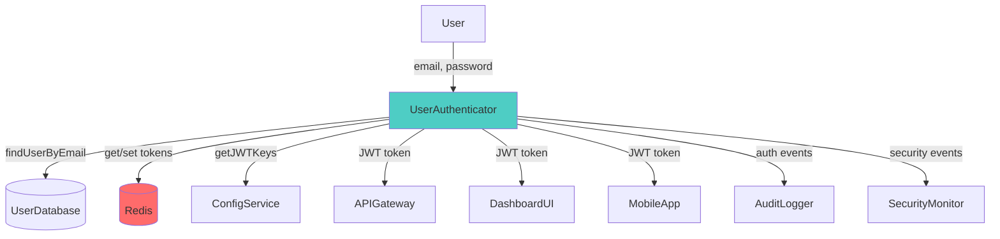
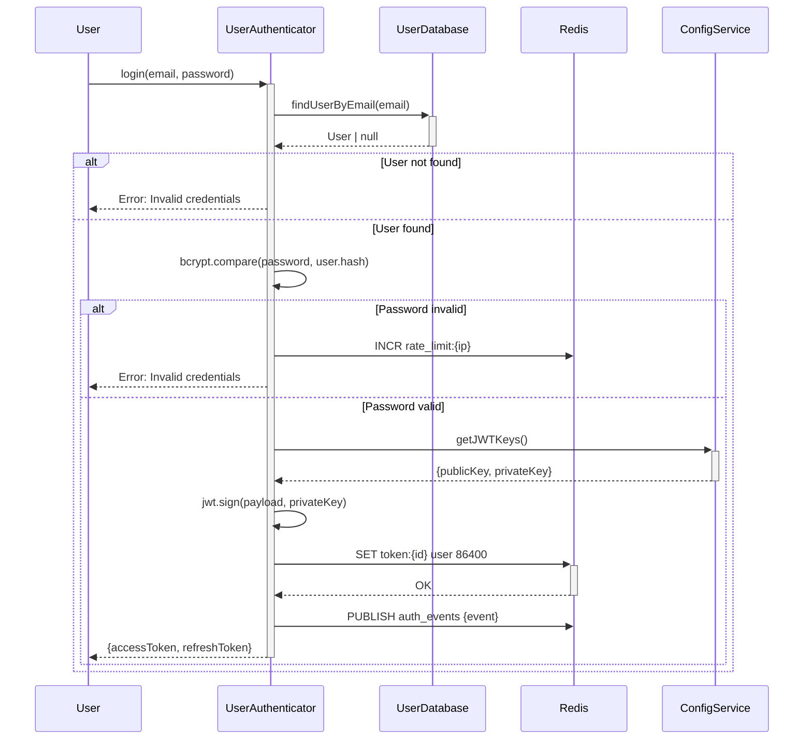

# spec2 Phase A Improvements — Addressing Context Overload & Review Burnout

**Date**: April 11, 2026
**Status**: Design Complete — Ready for Implementation

---

## Problems Identified

### Problem 1: Tier 4 Context Overload

**Current Approach:**
- Tier 4 loads ALL component specs at once (10+ components × 12 pages = 120+ pages)
- Single LLM call must process entire corpus to identify cross-cutting concerns
- Brittle, error-prone, hits context limits on larger systems

**Why This Fails:**
- Context window waste (90% of spec text irrelevant to integration analysis)
- Cannot scale beyond ~15 components
- Difficult to do incremental updates (must reload everything)

### Problem 2: Human Review Burnout

**Current Approach:**
- User reviews Tier 3 component specs sequentially
- Each spec is 12 pages of dense technical text
- 10 components = 120 pages to read linearly
- 20-30 minutes per component = 3-5 hours total review time

**Why This Fails:**
- Cognitive overload (text-heavy format, hard to spot issues)
- Decision fatigue (too many sequential decisions)
- Context switching cost (each component is independent)
- No visual representation (hard to see data flows, dependencies)

---

## Solution 1: Integration Registry Pattern

### Concept

Instead of loading all component specs into Tier 4, build an **incremental integration database** during Tier 3. Tier 4 queries the database instead of re-reading specs.

**Inspiration**: Confluent Schema Registry (Kafka), OpenAPI aggregation, Bazel dependency graphs

### Architecture

```
Tier 3 (per component):
┌─────────────────────┐
│ Generate Component  │
│ Spec (12 pages)     │
└──────────┬──────────┘
           │
           ▼
┌─────────────────────┐
│ Extract Integration │  ← NEW: Metadata extraction agent
│ Metadata (JSON)     │
└──────────┬──────────┘
           │
           ▼
┌─────────────────────┐
│ Store in SQLite DB  │  ← Integration Registry
│ .spec2/registry   │
└─────────────────────┘

Tier 4:
┌─────────────────────┐
│ Query Registry      │  ← SQL queries, not LLM text parsing
│ - Find conflicts    │
│ - Detect cycles     │
│ - Check consistency │
└──────────┬──────────┘
           │
           ▼
┌─────────────────────┐
│ Generate Integration│  ← Context: 10 pages (from analysis)
│ Spec from Results   │     vs 120 pages (from all specs)
└─────────────────────┘
```

### Data Model

**IntegrationMetadata Schema:**
```typescript
interface IntegrationMetadata {
  component: string;
  subsystem: string;

  // What this component provides to others
  exports: {
    types: {name: string, definition: string, usage: string}[];
    functions: {name: string, signature: string, purpose: string}[];
    events?: {name: string, payload: string, when: string}[];
  };

  // What this component needs from others
  imports: {
    type: 'function' | 'type' | 'data' | 'event';
    name: string;
    from?: string;  // which component/subsystem
    contract: string;  // expected interface
  }[];

  // Data flows
  dataFlow: {
    consumes: {source: string, format: string, schema?: object}[];
    produces: {destination: string, format: string, schema?: object}[];
  };

  // Cross-cutting concerns
  concerns: {
    authentication?: {method: string, tokenFormat: string};
    authorization?: {model: string};  // RBAC, ABAC, etc.
    logging?: {format: string, level: string};
    errors?: {errorCodeFormat: string, propagation: string};
    observability?: {metrics: string[], tracing: string};
  };
}
```

**SQLite Schema:**
```sql
CREATE TABLE components (
  id INTEGER PRIMARY KEY,
  name TEXT UNIQUE NOT NULL,
  subsystem TEXT NOT NULL,
  metadata_json TEXT NOT NULL,  -- Full IntegrationMetadata
  created_at DATETIME DEFAULT CURRENT_TIMESTAMP
);

CREATE TABLE exports (
  id INTEGER PRIMARY KEY,
  component_id INTEGER REFERENCES components(id),
  type TEXT NOT NULL,  -- 'type', 'function', 'event'
  name TEXT NOT NULL,
  definition TEXT NOT NULL,
  INDEX idx_name (name)
);

CREATE TABLE imports (
  id INTEGER PRIMARY KEY,
  component_id INTEGER REFERENCES components(id),
  type TEXT NOT NULL,
  name TEXT NOT NULL,
  from_component TEXT,
  contract TEXT NOT NULL,
  INDEX idx_name (name)
);

CREATE TABLE data_flows (
  id INTEGER PRIMARY KEY,
  from_component TEXT NOT NULL,
  to_component TEXT NOT NULL,
  data_type TEXT NOT NULL,
  format TEXT NOT NULL,
  schema_json TEXT
);
```

### Modified Tier 3 Workflow

**Before (4 steps):**
1. Generate component spec
2. Lock spec
3. User reviews spec
4. Approve/reject

**After (6 steps):**
1. Generate component spec
2. **Extract integration metadata** ← NEW
3. **Validate metadata completeness** ← NEW (automated checks)
4. **Store in registry** ← NEW
5. Lock spec
6. User reviews spec
7. Approve/reject

### New Tier 4 Workflow

**Before:**
```typescript
async function generateIntegrationSpec(componentSpecs: Map<string, string>) {
  // Load 120+ pages into single context
  const allSpecs = Array.from(componentSpecs.values()).join('\n\n');

  const agent = await Task.launch({
    prompt: `Find cross-cutting concerns in these specs:\n\n${allSpecs}`,
    // ... 120 pages of context
  });
}
```

**After:**
```typescript
async function generateIntegrationSpec() {
  const db = await openDatabase('.spec2/integration-registry.db');

  // Efficient SQL queries (ms, not minutes)
  const unresolvedImports = await db.all(`
    SELECT i.name, i.component_id, i.from_component
    FROM imports i
    LEFT JOIN exports e ON i.name = e.name
    WHERE e.id IS NULL
  `);

  const namingConflicts = await db.all(`
    SELECT name, COUNT(*) as count
    FROM exports
    GROUP BY name
    HAVING count > 1
  `);

  const dataFlowCycles = await detectCycles(db);  // Graph algorithm
  const crossCuttingInconsistencies = await findInconsistencies(db);

  // Generate spec from analysis results (10 pages, not 120)
  const agent = await Task.launch({
    subagent_type: 'odin:architect',
    prompt: `Generate integration specification from analysis.

    Findings:
    - Unresolved dependencies: ${JSON.stringify(unresolvedImports, null, 2)}
    - Naming conflicts: ${JSON.stringify(namingConflicts, null, 2)}
    - Data flow cycles: ${JSON.stringify(dataFlowCycles, null, 2)}
    - Inconsistencies: ${JSON.stringify(crossCuttingInconsistencies, null, 2)}

    Generate:
    1. Shared type definitions to resolve conflicts
    2. Interface contracts for all dependencies
    3. Data flow specification
    4. Cross-cutting standards (auth, logging, errors)`,
    description: 'Generate integration spec'
  });

  return await agent.result();
}
```

### Benefits

| Metric | Before | After | Improvement |
|--------|--------|-------|-------------|
| Context size | 120+ pages | ~10 pages | **12x reduction** |
| Query speed | N/A (full scan) | <100ms (indexed SQL) | **Instant lookups** |
| Incremental updates | Reload all specs | Query changes only | **Supports iteration** |
| Semantic search | Not possible | "Which components handle auth?" | **New capability** |
| Change impact | Unknown | Automatic dependency graph | **Safety net** |

---

## Solution 2: Visual Review Package

### Concept

For each Tier 3 component spec, auto-generate a **visual review package**: executive summary + diagrams. User reviews this (2-3 min) instead of 12-page spec (20+ min).

**Inspiration**: C4 Model (Simon Brown), executive reporting patterns, Mermaid auto-generation

### Review Package Structure

```
.spec2/specs/comp-UserAuthenticator/
├── spec.md                    # 12-page detailed spec (reference)
├── review-package.md          # 1-page executive summary ← User reads this
├── diagram-architecture.mmd   # Component architecture diagram
├── diagram-sequence.mmd       # Main flow sequence diagram
└── diagram-data.mmd           # Data model / state diagram (optional)
```

### Executive Summary Template

```markdown
# Component: UserAuthenticator

## Purpose (1 sentence)
Validates user credentials and issues JWT tokens for authenticated sessions.

## Key Decisions
- ✅ Use JWT with RS256 (not HS256) for token signing
- ✅ Password hashing: bcrypt with cost factor 12
- ✅ Session duration: 24h access token + 7d refresh token
- ✅ Store revoked tokens in Redis (not database)

## Critical Constraints
- ⚠️ Rate limit: 5 login attempts per IP per minute
- ⚠️ Password requirements: 8+ chars, mixed case, numbers, special chars
- ⚠️ Token revocation requires Redis availability (fallback: deny all)
- ⚠️ JWT keys must be RSA 2048-bit minimum

## Integration Points
**Consumes:**
- UserDatabase.findUserByEmail(email) → User | null
- ConfigService.getJWTKeys() → {publicKey, privateKey}
- Redis.set(key, value, ttl) / Redis.get(key) → revocation list

**Produces:**
- JWT tokens → consumed by APIGateway, DashboardUI, MobileApp
- AuthEvent stream → consumed by AuditLogger, SecurityMonitor

**Depends on:**
- Redis (CRITICAL: system unavailable if down)
- ConfigService (startup only)
- UserDatabase (per-request)

## Risk Areas
- 🔴 **HIGH**: JWT key rotation strategy not specified → tokens irrevocable if key leaks
- 🔴 **HIGH**: Redis single point of failure → no auth if Redis down
- 🟡 **MEDIUM**: No MFA support in initial design → planned for Phase 2
- 🟡 **MEDIUM**: Rate limiting by IP may impact shared IPs (offices, NAT)
- 🟢 **LOW**: bcrypt cost factor 12 may be slow on weak hardware
```

### Diagram Generation

**Architecture Diagram (Mermaid):**


**Sequence Diagram (Mermaid):**


### Modified User Review Workflow

**Before:**
1. Agent generates 12-page detailed spec
2. User reads 12 pages linearly (~20-30 min)
3. User approves or requests changes
4. **Total: 20-30 min per component**

**After:**
1. Agent generates 12-page detailed spec
2. **Agent auto-generates review package:**
   - Executive summary (LLM extracts key points)
   - 2-3 Mermaid diagrams (LLM generates from spec)
3. User reviews 1-page summary + diagrams (~2-5 min)
4. If concerns arise, user reads relevant section of detailed spec
5. User approves or requests changes
6. **Total: 2-5 min per component (5-10x faster)**

### Benefits

| Metric | Before | After | Improvement |
|--------|--------|-------|-------------|
| Review time | 20-30 min | 2-5 min | **5-10x faster** |
| Cognitive load | High (dense text) | Low (visual + summary) | **Much easier** |
| Issue detection | Slow (text scanning) | Fast (visual patterns) | **Faster QA** |
| Decision fatigue | High (sequential) | Low (batch review possible) | **Less burnout** |
| Total review time (10 components) | 3-5 hours | 20-50 min | **4-6x reduction** |

---

## Additional Optimizations

### 1. Automated Pre-Flight Checks

Before presenting spec to human, run automated validators:

```typescript
interface PreFlightCheck {
  completeness: boolean;  // All required sections present?
  consistency: boolean;   // Types referenced are defined?
  lint: boolean;         // Naming conventions followed?
  integration: boolean;  // Metadata extracted successfully?
}

async function runPreFlight(spec: string): Promise<PreFlightCheck> {
  // Automated checks (no LLM needed)
  const hasAllSections = checkSections(spec);
  const typesResolved = checkTypeReferences(spec);
  const lintPassed = await lintSpec(spec);
  const metadataValid = await validateMetadata(spec);

  return {
    completeness: hasAllSections,
    consistency: typesResolved,
    lint: lintPassed,
    integration: metadataValid
  };
}

// Only show to human if pre-flight passes
if (!preFlightPassed) {
  // Auto-fix or regenerate spec
}
```

### 2. Parallel Artifact Generation (Phase 2)

**Current (Phase A plan)**: Artifacts generated sequentially
**Optimized**: Parallelize since artifacts are per-component

```typescript
// Before (sequential)
for (const [component, spec] of componentSpecs) {
  await generateAndAuditArtifacts(spec, integrationSpec, component);
}

// After (parallel)
await Promise.all(
  Array.from(componentSpecs.entries()).map(([component, spec]) =>
    generateAndAuditArtifacts(spec, integrationSpec, component)
  )
);
```

**Benefit**: Phase 2 completion time reduced from `N × avg_time` to `max_time`

### 3. Content-Based Caching

Use SHA256 checksums to detect if specs have changed:

```typescript
interface SpecCache {
  specHash: string;
  metadataHash: string;
  artifactsHash: string;
  codeHash: string;
}

async function buildComponent(spec: string) {
  const currentHash = sha256(spec);
  const cached = await loadCache(component);

  if (cached?.specHash === currentHash) {
    console.log('✓ Spec unchanged, reusing artifacts');
    return cached;
  }

  // Regenerate only what changed
  if (cached?.metadataHash !== metadataHash) {
    await regenerateMetadata();
  }

  // ... incremental rebuild
}
```

### 4. Smart Batching for Review

Instead of reviewing components one-by-one, batch related components:

```typescript
// Group by subsystem
const batches = groupBySubsystem(components);

for (const batch of batches) {
  // Review 3-5 related components together
  // Reduces context switching, sees relationships
  await reviewBatch(batch);
}
```

### 5. Change Impact Analysis

When a spec changes, compute which downstream artifacts need regeneration:

```typescript
async function computeImpact(changedComponent: string) {
  const db = await openDatabase('.spec2/integration-registry.db');

  // Which components import from this one?
  const dependents = await db.all(`
    SELECT DISTINCT component_id
    FROM imports
    WHERE from_component = ?
  `, [changedComponent]);

  // Tier 4 integration spec needs regeneration
  const needsIntegrationUpdate = dependents.length > 0;

  return {
    artifactsToRegenerate: [changedComponent],
    codeToRegenerate: [changedComponent],
    integrationSpecUpdate: needsIntegrationUpdate,
    dependentComponents: dependents  // May need review
  };
}
```

---

## Implementation Plan — Revised Phase A

### Original Phase A (from SESSION_CONTEXT.md)

| Step | Task | Time | Deliverable |
|------|------|------|-------------|
| 1 | Executable skill structure | 4h | TypeScript project setup |
| 2 | Task-based agent launching | 8h | Tier 1-4 agent wrappers |
| 3 | Artifact generation loop | 4h | Gen + audit with fresh contexts |
| 4 | Code gen + validation loop | 4h | One-shot + fix iteration |
| 5 | Integration + testing | 2h | End-to-end workflow |
| **Total** | | **22h** | **Fully automated /spec2:new** |

### Revised Phase A (with improvements)

| Step | Task | Time | Deliverable |
|------|------|------|-------------|
| 1 | Executable skill structure | 4h | TypeScript project setup |
| 2 | Task-based agent launching | 8h | Tier 1-4 agent wrappers |
| 3 | Artifact generation loop | 4h | Gen + audit with fresh contexts |
| **3.5** | **Integration Registry** | **6h** | **SQLite DB + metadata extraction** |
| **3.6** | **Visual Review Package** | **8h** | **Summary + diagram generators** |
| 4 | Code gen + validation loop | 4h | One-shot + fix iteration |
| 5 | Integration + testing | 2h | End-to-end workflow |
| **Total** | | **36h** | **Fully automated /spec2:new + optimizations** |

### New Deliverables

**Integration Registry (Step 3.5 — 6 hours):**
1. SQLite schema definition
2. Database initialization utility
3. Metadata extraction agent (`extractIntegrationMetadata()`)
4. Metadata validator (pre-flight checks)
5. Registry query functions (find conflicts, cycles, inconsistencies)
6. Revised Tier 4 implementation using registry

**Visual Review Package (Step 3.6 — 8 hours):**
1. Executive summary generator agent
2. Mermaid diagram generator agent (architecture, sequence, data)
3. Review package assembly utility
4. Modified user approval workflow (summary-first)
5. Diagram rendering (optional: HTML preview)

**File Structure:**
```
~/.claude/skills/spec2-new/
├── skill.ts
├── orchestrate.ts
├── agents/
│   ├── tier1.ts
│   ├── tier2.ts
│   ├── tier3.ts
│   ├── tier4.ts              # REVISED: uses registry
│   ├── artifact.ts
│   ├── codegen.ts
│   ├── metadata-extractor.ts  # NEW
│   └── review-package.ts      # NEW
├── registry/
│   ├── schema.sql             # NEW
│   ├── queries.ts             # NEW
│   └── analysis.ts            # NEW: conflict detection, cycle detection
├── utils/
│   ├── lock.ts
│   ├── extract.ts
│   ├── validate.ts
│   └── cache.ts               # NEW: SHA256-based caching
├── tsconfig.json
└── package.json
```

---

## Cost-Benefit Analysis

### Costs

- **Development time**: +14 hours (36h vs 22h)
- **Complexity**: SQLite dependency, diagram generation
- **Disk space**: Registry DB (~1-10 MB per project)

### Benefits

**Tier 4 Context Reduction:**
- 12x context reduction (120 pages → 10 pages)
- Instant queries (SQL vs full text scan)
- Incremental updates (change 1 component, not reload all)
- Semantic search capability
- Change impact analysis

**Human Review Efficiency:**
- 5-10x faster review (20-30 min → 2-5 min per component)
- 4-6x total time reduction (3-5 hours → 20-50 min for 10 components)
- Visual patterns easier to understand
- Less cognitive load, less decision fatigue
- Can batch related components

**Quality Improvements:**
- Automated pre-flight checks catch errors early
- Diagrams reveal architectural issues faster
- Integration conflicts detected automatically
- Risk areas highlighted prominently

**Long-term Benefits:**
- Caching enables incremental iteration
- Registry supports future tooling (semantic search, impact analysis)
- Diagram generation reusable for documentation
- Pattern scales to 50+ components (current approach fails at ~15)

### Verdict

**ROI: Strongly positive**
- Upfront cost: +14 dev hours
- Ongoing savings: ~2-4 hours per build (for 10-component systems)
- Break-even: After 4-7 builds
- Usability improvement: Dramatic (users will actually use the tool)

---

## Recommendation

**Implement both improvements in Phase A.**

The original 22-hour Phase A plan was already substantial. Adding 14 hours (64% increase) is significant, but justified:

1. **User Experience**: Without these improvements, the tool is painful to use:
   - Reading 120 pages of specs per build → users will avoid using it
   - Tier 4 failures on larger projects → trust erosion

2. **Scalability**: Current design fails at ~15 components. Registry scales to 50+.

3. **Industry Alignment**: These patterns are proven (Schema Registry, C4 Model, executive reporting).

4. **Future-Proofing**: Registry enables advanced features later (semantic search, AI suggestions).

**Alternative**: Ship Phase A without improvements, then add them in Phase A.5 after user feedback. **Not recommended** — users will form negative first impressions.

---

## Next Steps

1. **User Decision**: Approve 36-hour Phase A with improvements?
2. **Implementation Order**:
   - Steps 1-2 (12h): Basic automation
   - Step 3.5 (6h): Integration Registry
   - Step 3 (4h): Artifact generation
   - Step 3.6 (8h): Visual Review Package
   - Steps 4-5 (6h): Code generation + testing
3. **Testing**: Build sample 5-component system to validate workflow
4. **Documentation**: Update SKILL.md with new capabilities

---

**Status**: Design complete, ready for implementation approval.
